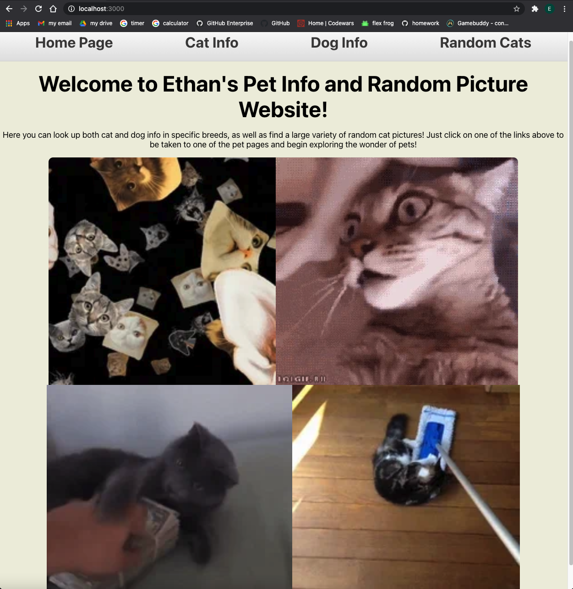

# Pet pages

## Description
This project is a react application that draws from two different API's to display information on specific breeds of cats and dogs, as well as show different categorized pictures of cats. This app soley uses React for DOM manipulation.
  

  

## Technologies Used

I used JS, HTML, CSS, and the react library (within react useState, useEffect, and react-router-dom), as well as a couple of giphys 

## Getting Started/Installation Instructions

The site is pretty self explanatory, use the links in the top to navigate through the site, when on an info tab use the drop down to pick your breed and then just observe the info, for random cats just pick a category and scroll through the pictures, you can hit the more button for more cats. From github, you can fork the repo for the program (repo url here), then clone it into a local and open that in an IDE 

## Contribution Guidelines
To suggest improvements, go to the github repo (url here) then either submit an issue describing an improvement, or make changes locally and submit a pull request.
